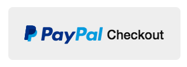

# How does PayPal checkout work?


## What is PayPal checkout?
PayPal checkout is a way for online merchants to integrate their payment flow with PayPal so customers can seamlessly pay for their orders using their PayPal account. This is especially useful with merchants where the customer doesn't already have an account with stored payment information, as they are saved the trouble of entering sensitive payment information on the merchant's website. It is also a good practice to use this option, versus saving their credit card information on a merchant's site - not knowing how safe that data is on their systems.

A customer usually sees a PayPal checkout button during the checkout process, indicating feature availability.

## UX Overview
When a customer clicks on the PayPal checkout button on a merchant's website, they are redirected to [www.paypal.com](https://www.paypal.com), and signed in with their PayPal account. 

There, they select the payment source (credit card etc.), and associated (billing/shipping) addresses for the order.

They complete the payment either on PayPal's site - at which point they are returned to the merchant's website with an order confirmation, or they return to the merchant's website to complete the transaction.

## Example Flow (using "Humble Bundle")
In this case, the customer completes payment on PayPal, and is returned to Humble Bundle with an order confirmation.

Let's take a look at the network traffic involved, when attempting such a purchase from "Humble Bundle". 

Once the "pay what you want" price is selected in a bundle, the user clicks "Checkout with PayPal". 

A `POST` request is made to `www.humblebundle.com/humbler/submit` indicating that the user intends to use PayPal. Humble Bundle responds with a `redirect_url`, sending the user to PayPal.

### Forward to PayPal
PayPal is sent a token representing the transaction, and the `useraction=commit` indicates that the transaction will be completed on PayPal's site itself.
```
GET /cgi-bin/webscr?cmd=_express-checkout&token=EC-1Y617337H2069072R&useraction=commit
Host: www.paypal.com
```

### Return from PayPal
Once the payment is completed on PayPal, the user is sent back to Humble Bundle, with the token, and a `PayerID` that represents the user's PayPal account.
```
GET /return-paypal?token=EC-1Y617337H2069072R&PayerID=REDACTED
Host: www.humblebundle.com
```
> Out of Scope - Humble Bundle then, on the server-side, queries PayPal to ensure that the PayerID has indeed paid for the order. 

Once this has been confirmed, Humble Bundle then shows the customer their order receipt.

```
https://www.humblebundle.com/receipt?uidverify=1c85033f89f118875747a2aead135cde29872987a049ccb2f59cadfe6d67450f&s=thanks&m=p&uid=XZF2ZQ3ZB5ZUZ
```

## Example Flow (using "BestBuy")
In this case, the customer completes payment on the merchant (BestBuy) site after choosing payment options on PayPal.

A `POST` request is made to `www.bestbuy.com/cart/paypalCheckout` indicating that the user intends to use PayPal. BestBuy responds with a `redirectUrl`, sending the user to PayPal.

### Forward to PayPal

Note that in this case, the `useraction=commit` parameter is not sent, indicating that the user will be returned to the merchant to complete the transaction.

```
GET /cgi-bin/webscr?cmd=_express-checkout&token=EC-26591387LP888611L
Host: www.paypal.com
```

### Return from PayPal
Once the user has selected their PayPal options, they are returned to BestBuy to confirm the order.
```
GET /checkout/r/paypal/success?redirect=/checkout/r/fast-track&orderId=bef9e090-b1eb-11eb-aa5a-71fd7fc5c2db&token=EC-26591387LP888611L&PayerID=REDACTED HTTP/2
Host: www.bestbuy.com
```
